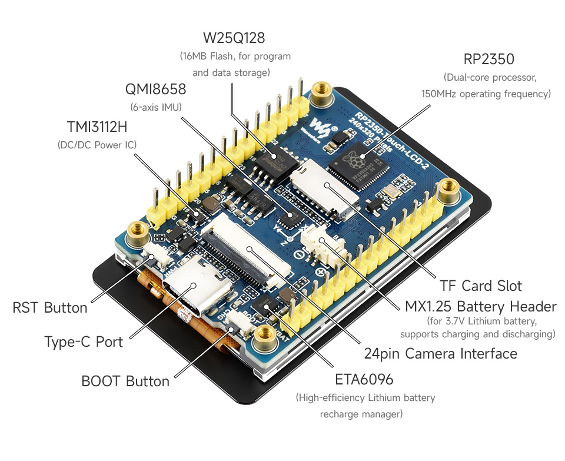
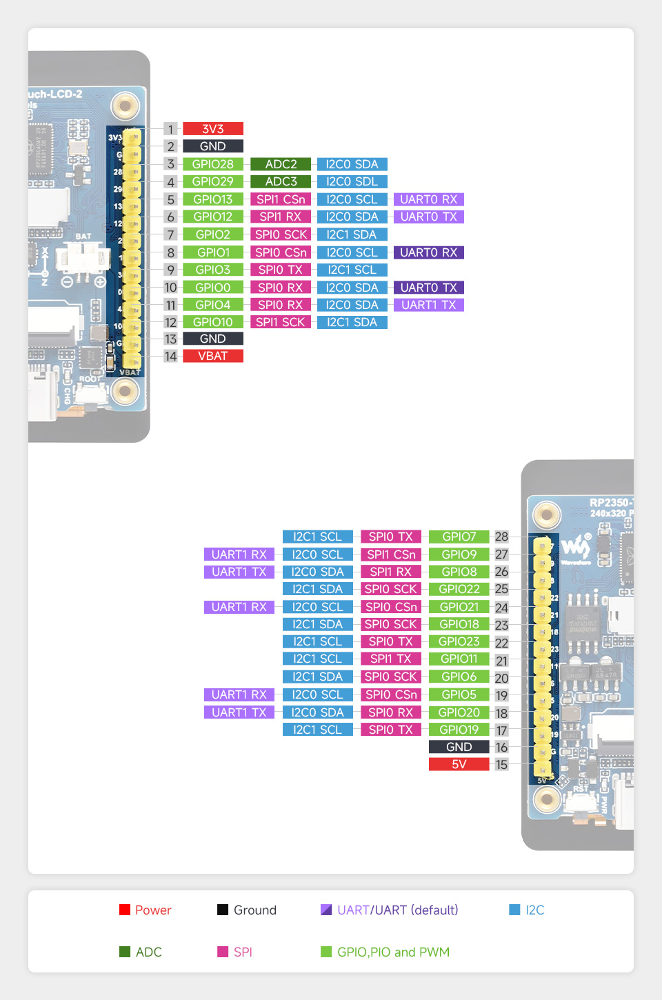
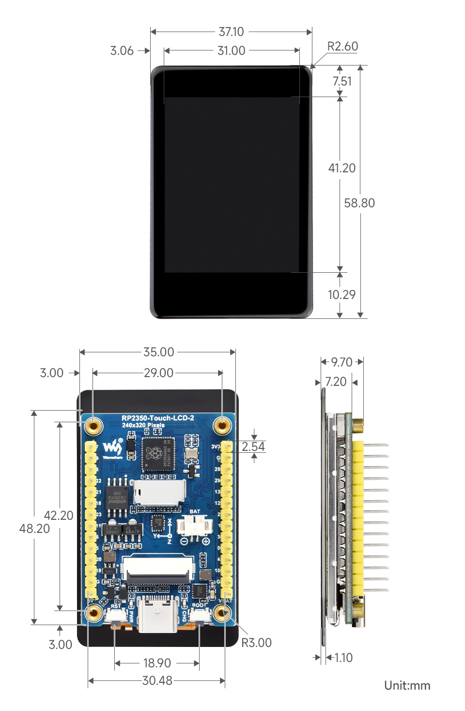

# RP2350 Touch LCD 2 SSTV Transmitter

This project is a natural continuation of the [**WSPR-Pico**](https://github.com/f4goh/wspr-pico/) project

While WSPR-Pico demonstrated that the Raspberry Pi RP2040 could be used as a compact and efficient HF beacon, the [**Waveshare RP2350 Touch LCD 2**](https://www.waveshare.com/wiki/RP2350-Touch-LCD-2) provides an even more capable platform for building a standalone **HF SSTV transmitter**.

The board combines a powerful **Raspberry Pi RP2350** microcontroller with a bright **2-inch capacitive touch display**, making it ideal for generating, displaying, and transmitting SSTV images without additional hardware. The integrated LCD offers a convenient user interface for image selection, transmission control, and system monitoring.

## Main Features

- Raspberry Pi **RP2350** microcontroller
- Dual-core ARM Cortex-M33 and dual-core Hazard3 RISC-V architecture
- Up to **150 MHz** CPU clock
- **520 KB SRAM**
- **16 MB Flash**
- USB Type-C connector
- 2-inch IPS capacitive touch LCD
- 240 × 320 resolution (262K colors)
- Camera connector compatible with OV2640 and OV5640
- On-board Li-Ion battery charging connector
- USB 1.1 Host and Device support
- 22 multifunction GPIOs
- 2 × SPI, 2 × I²C, 2 × UART
- 14 PWM channels
- 12 Programmable I/O (PIO) state machines
- Temperature sensor
- Hardware floating-point support
- Low-power sleep and dormant modes

## Display

- Controller: **ST7789T3**
- Interface: SPI
- Resolution: 240 × 320 pixels
- IPS panel
- Capacitive touch controller: **CST816D** (I²C)

## IMU

The board includes a **QMI8658** inertial measurement unit featuring:

- 16-bit accelerometer
  - ±2, ±4, ±8, ±16 g ranges
- 16-bit gyroscope
  - ±16 to ±2048°/s ranges

## Board Overview

## GPIO Assignment

### LCD (ST7789)

| GPIO | Function |
|------|----------|
| GPIO15 | LCD_BL (Backlight) |
| GPIO16 | LCD_DC (Data/Command) |
| GPIO17 | LCD_CS (Chip Select) |
| GPIO18 | LCD_CLK (SPI Clock) |
| GPIO19 | LCD_DIN (SPI MOSI) |
| GPIO20 | LCD_RST (Reset) |

### Touch Panel (CST816D)

| GPIO | Function |
|------|----------|
| GPIO29 | TP_INT |
| GPIO2  | TP_RST |
| GPIO22 | TP_SDA (I²C SDA) |
| GPIO3  | TP_SCL (I²C SCL) |

### Camera Connector

| GPIO | Function |
|------|----------|
| GPIO0  | CAM_D0 |
| GPIO1  | CAM_D1 |
| GPIO2  | CAM_D2 |
| GPIO3  | CAM_D3 |
| GPIO4  | CAM_D4 |
| GPIO5  | CAM_D5 |
| GPIO6  | CAM_D6 |
| GPIO7  | CAM_D7 |
| GPIO8  | CAM_HREF |
| GPIO9  | CAM_PCLK |
| GPIO10 | CAM_XCLK |
| GPIO11 | CAM_RESET |
| GPIO21 | CAM_PWDN |

### IMU (QMI8658)

| GPIO | Function |
|------|----------|
| GPIO12 | IMU_SDA |
| GPIO13 | IMU_SCL |
| GPIO14 | IMU_INT1 |

### External I²C

| GPIO | Function |
|------|----------|
| GPIO22 | TWI_SDA |
| GPIO23 | TWI_SCL |

### Expansion Header P1

| Pin | Signal |
|----:|--------|
| 1 | GPIO7 |
| 2 | GPIO9 |
| 3 | GPIO8 |
| 4 | GPIO22 |
| 5 | GPIO21 |
| 6 | GPIO18 |
| 7 | GPIO23 |
| 8 | GPIO11 |
| 9 | GPIO6 |
| 10 | GPIO5 |
| 11 | GPIO20 |
| 12 | GPIO19 |
| 13 | GND |
| 14 | 5V |

### Expansion Header P2

| Pin | Signal |
|----:|--------|
| 1 | 3V3 |
| 2 | GND |
| 3 | GPIO28 |
| 4 | GPIO29 |
| 5 | GPIO13 |
| 6 | GPIO12 |
| 7 | GPIO2 |
| 8 | GPIO1 |
| 9 | GPIO3 |
| 10 | GPIO0 |
| 11 | GPIO4 |
| 12 | GPIO10 |
| 13 | GND |
| 14 | VBAT |

